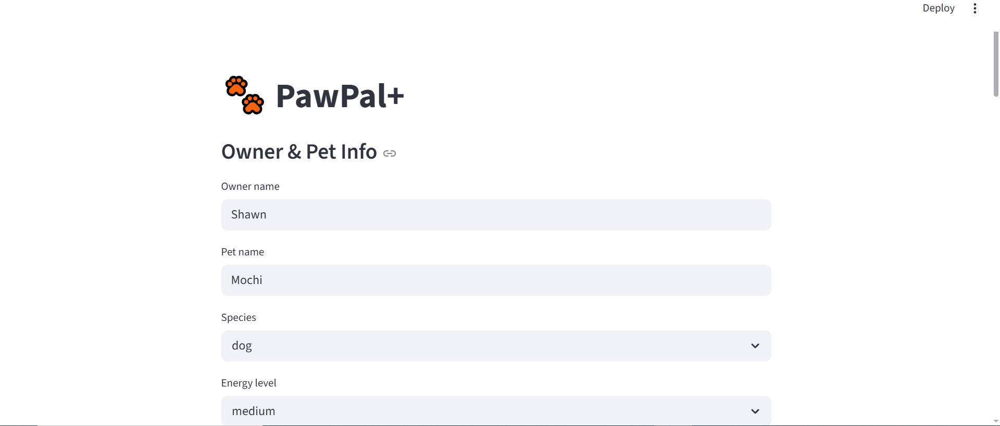
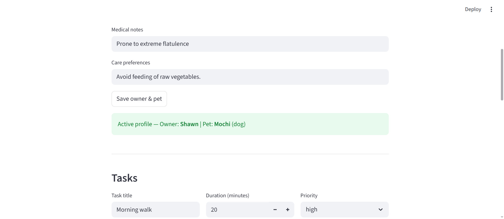
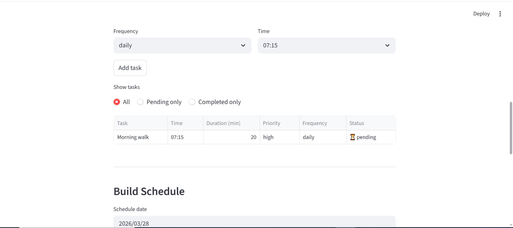
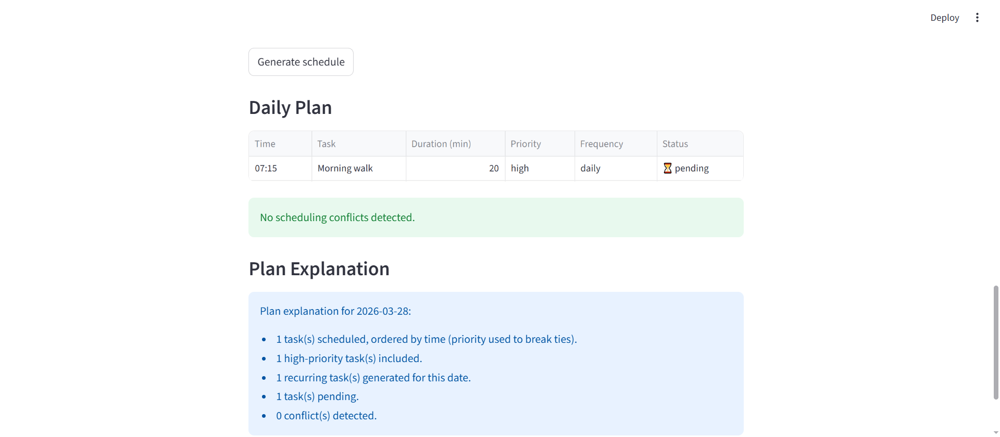

# PawPal+ (Module 2 Project)

You are building **PawPal+**, a Streamlit app that helps a pet owner plan care tasks for their pet.

## Scenario

A busy pet owner needs help staying consistent with pet care. They want an assistant that can:

- Track pet care tasks (walks, feeding, meds, enrichment, grooming, etc.)
- Consider constraints (time available, priority, owner preferences)
- Produce a daily plan and explain why it chose that plan

Your job is to design the system first (UML), then implement the logic in Python, then connect it to the Streamlit UI.

## What you will build

Your final app should:

- Let a user enter basic owner + pet info
- Let a user add/edit tasks (duration + priority at minimum)
- Generate a daily schedule/plan based on constraints and priorities
- Display the plan clearly (and ideally explain the reasoning)
- Include tests for the most important scheduling behaviors

## Getting started

### Setup

```bash
python -m venv .venv
source .venv/bin/activate  # Windows: .venv\Scripts\activate
pip install -r requirements.txt
```

### Suggested workflow

1. Read the scenario carefully and identify requirements and edge cases.
2. Draft a UML diagram (classes, attributes, methods, relationships).
3. Convert UML into Python class stubs (no logic yet).
4. Implement scheduling logic in small increments.
5. Add tests to verify key behaviors.
6. Connect your logic to the Streamlit UI in `app.py`.
7. Refine UML so it matches what you actually built.

## Features

- **Time-based scheduling with priority tie-breaks**: tasks are ordered chronologically, and priority is used when tasks share the same time.
- **Rule-based recurring task generation**: recurring tasks are produced for a target date (`once`, `daily`, `weekly`) based on date and weekday rules.
- **Conflict detection for overlaps**: task collisions are detected by comparing each task's end time to the next task's start time.
- **Flexible task filtering**: task lists can be filtered by pet name and completion status.
- **Recurring completion workflow**: marking recurring tasks complete can generate the next scheduled instance.
- **Pending-task extraction**: pets can return only incomplete tasks for focused daily planning.
- **Plan explanation metrics**: the scheduler summarizes plan construction, including total, high-priority, recurring, pending, and conflict counts.

## Testing PawPal+

Run the test suite with:
```bash
python -m pytest
```

The suite covers:
- Task completion and status change
- Task addition and pet task count
- Pending task filtering
- Date-based task cloning
- Conflict detection between overlapping tasks
- Chronological sort order
- Recurring task next-occurrence generation

**Confidence level: ⭐⭐⭐⭐ (4/5)**

The core scheduling behaviors are verified across 8 tests covering task completion, sorting, conflict detection, recurring task generation, and pending filtering.

A **Confidence level: ⭐⭐⭐⭐⭐ (5/5)** would require coverage of edge cases that are currently untested:

- An owner with no pets, or a pet with no tasks
- Weekly tasks being correctly excluded on non-matching weekdays
- Conflict behavior when tasks from different pets overlap at the same time

These gaps do not affect normal use of the app but represent scenarios where the system's behavior is assumed rather than verified.

## 📸 Demo





